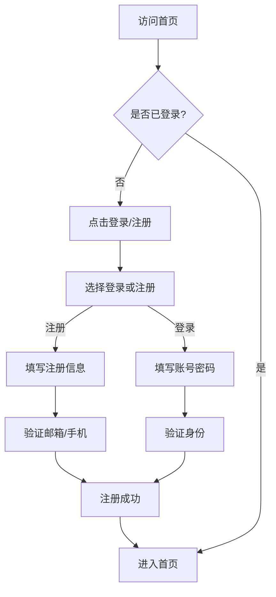
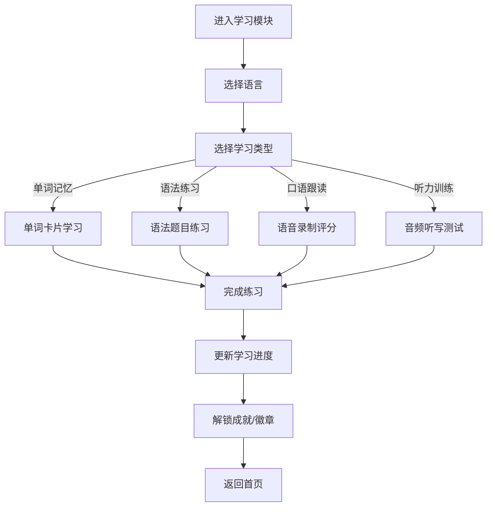
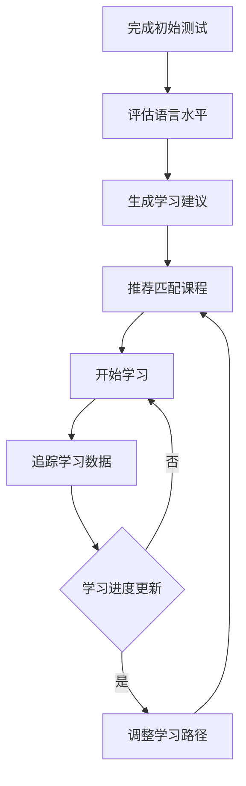

## 1. 产品概述

LinguaMaster是一款沉浸式多语种在线教育平台，专注于英语、日语、韩语等主流语言学习，为用户提供分级课程体系、互动式学习模块、个性化学习路径及社区激励系统。

- **核心目标**: 通过科学的学习方法和丰富的互动体验，帮助用户高效掌握第二语言
- **目标用户**: 语言学习者（初学者到高级进阶者）、备考人群、职场人士
- **市场价值**: 提供一站式语言学习解决方案，打破传统学习的枯燥感

## 2. 核心功能

### 2.1 用户角色

| 角色 | 注册方式 | 核心权限 |
|------|----------|----------|
| 普通用户 | 邮箱/手机号注册 | 浏览课程、使用基础学习功能、参与社区 |
| 会员用户 | 订阅升级 | 解锁全部课程、高级学习功能、专属成就 |
| 管理员 | 后台注册 | 管理课程内容、用户数据、系统配置 |

### 2.2 功能模块

1. **首页**: 学习概览、语言选择、推荐课程、学习数据统计
2. **课程中心**: 分级课程体系、课程详情、学习进度
3. **学习模块**: 单词记忆、语法练习、口语跟读、听力训练
4. **个人中心**: 用户信息、学习记录、成就系统、设置
5. **社区**: 学习论坛、打卡分享、互动交流

### 2.3 页面详情

| 页面名称 | 模块名称 | 功能描述 |
|----------|----------|----------|
| 首页 | 导航栏 | 语言切换、搜索、登录入口、通知 |
| 首页 | 学习概览 | 今日学习目标、连续学习天数、总学习时长 |
| 首页 | 语言选择 | 英语、日语、韩语卡片切换 |
| 首页 | 推荐课程 | 根据学习路径推荐的课程列表 |
| 首页 | 学习数据 | 本周学习时长、掌握单词数、成就徽章 |
| 课程中心 | 课程列表 | 按级别和类型分类的课程卡片 |
| 课程中心 | 课程详情 | 课程介绍、章节列表、开始学习入口 |
| 学习模块 | 单词记忆 | 单词卡片、拼写测试、记忆曲线复习 |
| 学习模块 | 语法练习 | 选择题、填空题、即时反馈 |
| 学习模块 | 口语跟读 | 语音录制、发音评分、对比播放 |
| 学习模块 | 听力训练 | 音频播放、听写练习、理解测试 |
| 个人中心 | 用户信息 | 头像、昵称、学习等级、经验值 |
| 个人中心 | 学习记录 | 历史学习数据、进度统计图表 |
| 个人中心 | 成就系统 | 解锁的徽章、排行榜、成就详情 |
| 个人中心 | 设置 | 学习偏好、通知设置、账户管理 |
| 社区 | 论坛首页 | 热门话题、最新帖子、分类浏览 |
| 社区 | 发帖详情 | 帖子内容、评论列表、点赞互动 |
| 社区 | 打卡分享 | 每日打卡、学习笔记分享 |
| 登录/注册 | 登录表单 | 邮箱/手机号、密码、第三方登录 |
| 登录/注册 | 注册表单 | 用户信息填写、验证码验证 |

## 3. 核心流程

### 用户注册登录流程

### 学习流程

### 个性化学习路径流程

## 4. 用户界面设计

### 4.1 设计风格

- **主色调**: 渐变蓝紫色 (#667eea → #764ba2)，传递智慧与创造力
- **辅助色**: 清新绿色 (#10b981) 用于成功状态，橙色 (#f59e0b) 用于提醒
- **字体**: 标题使用 Inter 粗体，正文使用 Inter 常规，多语言文字使用对应字体
- **按钮风格**: 圆角 (8px)，渐变填充，悬停时阴影加深
- **布局**: 卡片式设计，层次分明，大量留白提升阅读体验
- **图标**: 使用 Lucide React 图标库，线条简洁现代

### 4.2 页面设计概述

| 页面名称 | 模块名称 | UI元素 |
|----------|----------|--------|
| 首页 | Hero区域 | 渐变背景、浮动语言图标、CTA按钮、动画效果 |
| 首页 | 学习概览 | 环形进度条、数字统计、卡片式布局 |
| 课程中心 | 课程卡片 | 缩略图、级别标签、进度条、评分 |
| 学习模块 | 单词卡片 | 翻转效果、音频播放按钮、难度标记 |
| 学习模块 | 口语练习 | 波形动画、评分仪表盘、对比按钮 |
| 个人中心 | 成就墙 | 网格布局徽章、解锁动画、进度条 |
| 社区 | 帖子卡片 | 用户头像、内容预览、互动按钮 |

### 4.3 响应式设计

- **桌面端**: 完整功能展示，多栏布局，侧边导航
- **平板端**: 两栏布局，简化导航
- **移动端**: 单列布局，底部导航栏，触控优化

### 4.4 交互设计

- **微动画**: 页面加载时元素渐入、按钮悬停缩放、进度条平滑过渡
- **反馈机制**: 正确答案显示绿色勾选、错误显示红色提示、进度实时更新
- **语音交互**: 支持语音输入和播放，提供即时发音反馈
- **拖拽操作**: 单词卡片可拖拽排序，课程可拖拽收藏