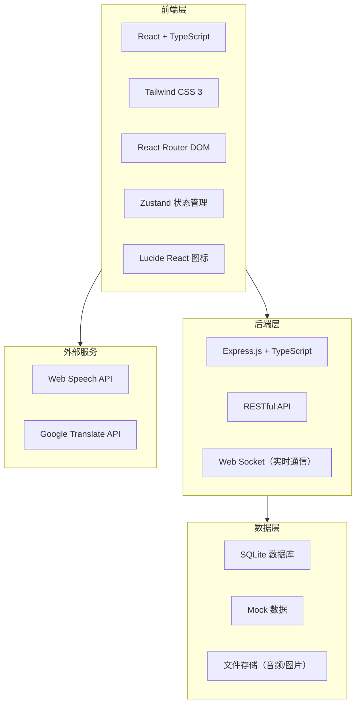
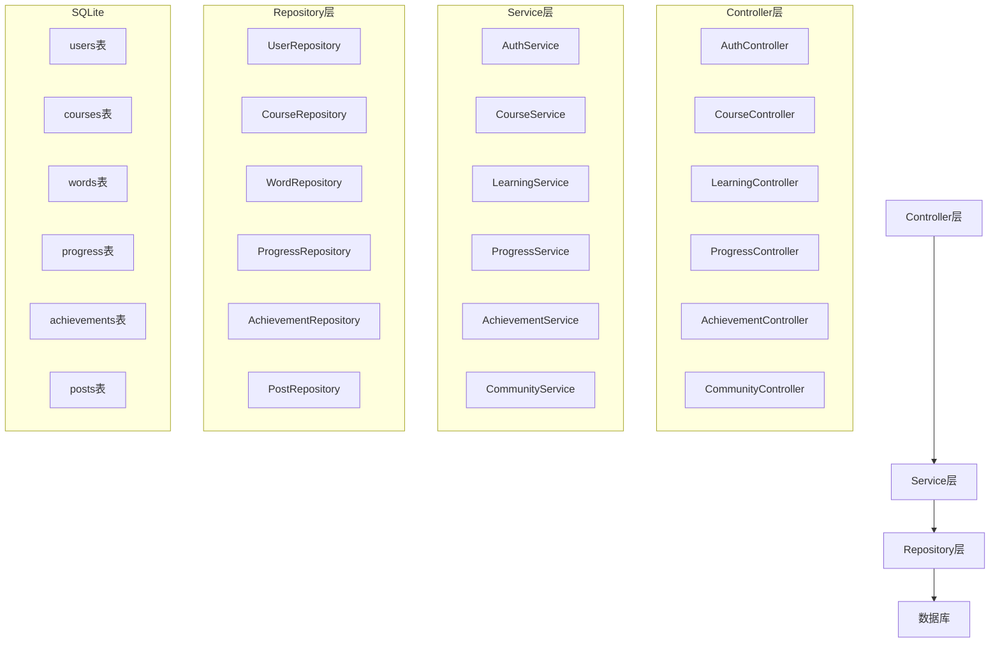
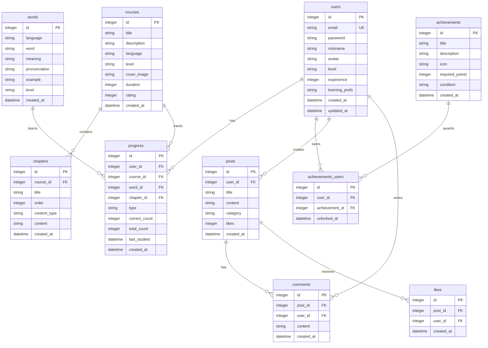

## 1. 架构设计



## 2. 技术栈说明

- **前端**: React@18 + TypeScript + Tailwind CSS@3 + Vite
- **路由**: React Router DOM@6
- **状态管理**: Zustand
- **图标库**: Lucide React
- **后端**: Express.js@4 + TypeScript
- **数据库**: SQLite（开发/演示）
- **构建工具**: Vite
- **包管理**: pnpm

## 3. 路由定义

| 路由 | 用途 | 组件 |
|------|------|------|
| / | 首页 | Home |
| /courses | 课程中心 | Courses |
| /courses/:id | 课程详情 | CourseDetail |
| /learn/:type | 学习模块 | Learn（单词/语法/口语/听力） |
| /profile | 个人中心 | Profile |
| /community | 社区 | Community |
| /community/:id | 帖子详情 | PostDetail |
| /login | 登录页面 | Login |
| /register | 注册页面 | Register |

## 4. API 定义

### 4.1 用户相关

| 方法 | 路径 | 描述 | 请求体 | 响应体 |
|------|------|------|--------|--------|
| POST | /api/auth/register | 用户注册 | `{ email, password, nickname }` | `{ user, token }` |
| POST | /api/auth/login | 用户登录 | `{ email, password }` | `{ user, token }` |
| GET | /api/users/me | 获取当前用户 | - | `{ user }` |
| PUT | /api/users/me | 更新用户信息 | `{ nickname, avatar, learningPrefs }` | `{ user }` |

### 4.2 课程相关

| 方法 | 路径 | 描述 | 请求体 | 响应体 |
|------|------|------|--------|--------|
| GET | /api/courses | 获取课程列表 | `{ language, level }` | `{ courses }` |
| GET | /api/courses/:id | 获取课程详情 | - | `{ course }` |
| GET | /api/courses/:id/chapters | 获取课程章节 | - | `{ chapters }` |

### 4.3 学习相关

| 方法 | 路径 | 描述 | 请求体 | 响应体 |
|------|------|------|--------|--------|
| GET | /api/learning/words | 获取单词列表 | `{ language, level }` | `{ words }` |
| POST | /api/learning/words | 提交单词学习记录 | `{ wordId, correct }` | `{ progress }` |
| GET | /api/learning/grammar | 获取语法题目 | `{ language, level }` | `{ questions }` |
| POST | /api/learning/grammar | 提交语法答案 | `{ questionId, answer }` | `{ result }` |
| POST | /api/learning/speaking | 提交口语练习 | `{ audio, transcript }` | `{ score }` |
| GET | /api/learning/listening | 获取听力材料 | `{ language, level }` | `{ material }` |

### 4.4 进度追踪

| 方法 | 路径 | 描述 | 请求体 | 响应体 |
|------|------|------|--------|--------|
| GET | /api/progress | 获取学习进度 | - | `{ progress }` |
| POST | /api/progress | 更新学习进度 | `{ courseId, chapterId, completed }` | `{ progress }` |
| GET | /api/progress/statistics | 获取学习统计 | - | `{ stats }` |

### 4.5 成就系统

| 方法 | 路径 | 描述 | 请求体 | 响应体 |
|------|------|------|--------|--------|
| GET | /api/achievements | 获取成就列表 | - | `{ achievements }` |
| GET | /api/achievements/user | 获取用户成就 | - | `{ userAchievements }` |
| POST | /api/achievements/unlock | 解锁成就 | `{ achievementId }` | `{ achievement }` |

### 4.6 社区相关

| 方法 | 路径 | 描述 | 请求体 | 响应体 |
|------|------|------|--------|--------|
| GET | /api/community/posts | 获取帖子列表 | `{ page, category }` | `{ posts }` |
| POST | /api/community/posts | 创建帖子 | `{ title, content, category }` | `{ post }` |
| GET | /api/community/posts/:id | 获取帖子详情 | - | `{ post }` |
| POST | /api/community/posts/:id/comments | 添加评论 | `{ content }` | `{ comment }` |
| POST | /api/community/posts/:id/likes | 点赞帖子 | - | `{ likes }` |
| POST | /api/community/checkin | 每日打卡 | `{ content }` | `{ checkin }` |

## 5. 服务器架构图



## 6. 数据模型

### 6.1 数据模型定义



### 6.2 数据定义语言

```sql
CREATE TABLE users (
    id INTEGER PRIMARY KEY AUTOINCREMENT,
    email TEXT UNIQUE NOT NULL,
    password TEXT NOT NULL,
    nickname TEXT NOT NULL,
    avatar TEXT DEFAULT 'default.png',
    level TEXT DEFAULT 'beginner',
    experience INTEGER DEFAULT 0,
    learning_prefs TEXT DEFAULT '{"language":"english","dailyGoal":30}',
    created_at DATETIME DEFAULT CURRENT_TIMESTAMP,
    updated_at DATETIME DEFAULT CURRENT_TIMESTAMP
);

CREATE TABLE courses (
    id INTEGER PRIMARY KEY AUTOINCREMENT,
    title TEXT NOT NULL,
    description TEXT,
    language TEXT NOT NULL,
    level TEXT NOT NULL,
    cover_image TEXT,
    duration INTEGER DEFAULT 0,
    rating REAL DEFAULT 0,
    created_at DATETIME DEFAULT CURRENT_TIMESTAMP
);

CREATE TABLE chapters (
    id INTEGER PRIMARY KEY AUTOINCREMENT,
    course_id INTEGER NOT NULL,
    title TEXT NOT NULL,
    `order` INTEGER DEFAULT 0,
    content_type TEXT NOT NULL,
    content TEXT,
    FOREIGN KEY (course_id) REFERENCES courses(id)
);

CREATE TABLE words (
    id INTEGER PRIMARY KEY AUTOINCREMENT,
    language TEXT NOT NULL,
    word TEXT NOT NULL,
    meaning TEXT NOT NULL,
    pronunciation TEXT,
    example TEXT,
    level TEXT DEFAULT 'beginner',
    created_at DATETIME DEFAULT CURRENT_TIMESTAMP
);

CREATE TABLE progress (
    id INTEGER PRIMARY KEY AUTOINCREMENT,
    user_id INTEGER NOT NULL,
    course_id INTEGER,
    word_id INTEGER,
    chapter_id INTEGER,
    type TEXT NOT NULL,
    correct_count INTEGER DEFAULT 0,
    total_count INTEGER DEFAULT 0,
    last_studied DATETIME,
    FOREIGN KEY (user_id) REFERENCES users(id),
    FOREIGN KEY (course_id) REFERENCES courses(id),
    FOREIGN KEY (word_id) REFERENCES words(id),
    FOREIGN KEY (chapter_id) REFERENCES chapters(id)
);

CREATE TABLE achievements (
    id INTEGER PRIMARY KEY AUTOINCREMENT,
    title TEXT NOT NULL,
    description TEXT,
    icon TEXT NOT NULL,
    required_points INTEGER DEFAULT 0,
    condition TEXT,
    created_at DATETIME DEFAULT CURRENT_TIMESTAMP
);

CREATE TABLE achievements_users (
    id INTEGER PRIMARY KEY AUTOINCREMENT,
    user_id INTEGER NOT NULL,
    achievement_id INTEGER NOT NULL,
    unlocked_at DATETIME DEFAULT CURRENT_TIMESTAMP,
    FOREIGN KEY (user_id) REFERENCES users(id),
    FOREIGN KEY (achievement_id) REFERENCES achievements(id)
);

CREATE TABLE posts (
    id INTEGER PRIMARY KEY AUTOINCREMENT,
    user_id INTEGER NOT NULL,
    title TEXT NOT NULL,
    content TEXT NOT NULL,
    category TEXT DEFAULT 'general',
    likes INTEGER DEFAULT 0,
    created_at DATETIME DEFAULT CURRENT_TIMESTAMP,
    FOREIGN KEY (user_id) REFERENCES users(id)
);

CREATE TABLE comments (
    id INTEGER PRIMARY KEY AUTOINCREMENT,
    post_id INTEGER NOT NULL,
    user_id INTEGER NOT NULL,
    content TEXT NOT NULL,
    created_at DATETIME DEFAULT CURRENT_TIMESTAMP,
    FOREIGN KEY (post_id) REFERENCES posts(id),
    FOREIGN KEY (user_id) REFERENCES users(id)
);

CREATE TABLE likes (
    id INTEGER PRIMARY KEY AUTOINCREMENT,
    post_id INTEGER NOT NULL,
    user_id INTEGER NOT NULL,
    created_at DATETIME DEFAULT CURRENT_TIMESTAMP,
    FOREIGN KEY (post_id) REFERENCES posts(id),
    FOREIGN KEY (user_id) REFERENCES users(id)
);
```